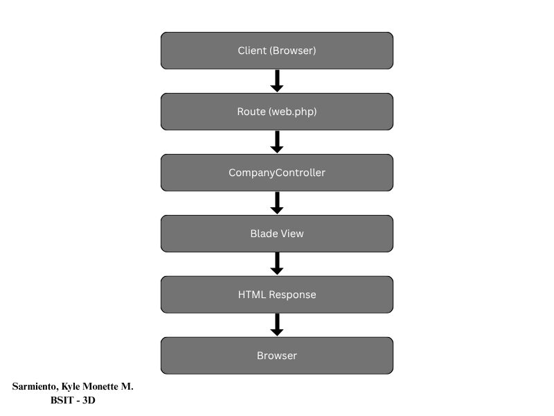

# Company Profile Website using Laravel MVC

## Introduction
I developed a Company Profile Website using Laravel. It is a multi-page website that displays important information about a company. I created this project to better understand how Laravel's MVC architecture works in a real-world application.

The website consists of four main pages: Home, About, Services, and Contact. I used Laravel's routing, controllers, and Blade templating to organize the code efficiently and maintain a clean structure.

## Objectives
Throughout this project, I was able to:
- Understand Laravel's Request Lifecycle
- Create and manage application routes
- Build dynamic views using Blade templates
- Organize code using the MVC pattern
- Deploy a project to GitHub

## MVC Architecture
MVC stands for Model-View-Controller. It is a software design pattern that separates an application into three interconnected components:

- **Model** – Manages the data and business logic
- **View** – Handles the user interface and presentation
- **Controller** – Processes user requests and coordinates between the Model and View

Laravel uses MVC to promote clean, organized, and maintainable code. It also allows developers to work on different parts of the application simultaneously without conflicts.

### Architecture Flow

Browser (User)
↓
Route (web.php)
↓
CompanyController
↓
Blade View
↓
HTML Response
↓
Browser

## Architecture Diagram



The diagram above illustrates the Laravel request flow:
1. Client (Browser) sends a request
2. Route (web.php) receives the request
3. CompanyController processes the request
4. Blade View renders the HTML response
5. HTML Response is sent back to the Browser

## Laravel Routing
Routing in Laravel defines the URLs of the application and maps them to specific controllers and methods.

**Route Definitions (routes/web.php):**
```php
Route::get('/', [CompanyController::class, 'home'])->name('home');
Route::get('/about', [CompanyController::class, 'about'])->name('about');
Route::get('/services', [CompanyController::class, 'services'])->name('services');
Route::get('/contact', [CompanyController::class, 'contact'])->name('contact');


---

### Controllers
```markdown
## Controllers
Controllers handle the logic of the application. They receive requests from the routes, process them, and return the appropriate views.

**CompanyController Methods:**
```php
public function home()
{
    return view('pages.home');
}

public function about()
{
    return view('pages.about');
}

public function services()
{
    return view('pages.services');
}

public function contact()
{
    return view('pages.contact');
}


---

### Blade Templating
```markdown
## Blade Templating Engine
Blade is Laravel's powerful templating engine that allows the use of dynamic content in views.

**Directives Used:**
- `@extends('layouts.app')` - Inherits the master layout
- `@section()` - Defines content sections
- `@yield()` - Renders section content


## Laravel Folder Structure
- **app/** - Contains core application logic (Models, Controllers, etc.)
- **routes/** - Contains route definitions (web.php, api.php)
- **resources/** - Contains views, CSS, and JavaScript files
- **public/** - Publicly accessible files (images, CSS, JavaScript)
- **bootstrap/** - Application bootstrap and caching
- **config/** - Application configuration files

## Screenshots


## Problems Encountered
1. **View not found** - Missing Blade templates caused errors when views were not created properly.
2. **Controller namespace issues** - Incorrect namespace prevented Laravel from finding the classes.
3. **@include errors** - Using @include without the actual component file caused runtime errors.

## Solutions
1. **View not found**: Created the missing Blade view files in the correct directory.
2. **Controller namespace issues**: Verified that the controller class had the proper namespace and was imported correctly.
3. **@include errors**: Removed the @include directives from the master layout and embedded the code directly.

## Reflection
Before starting this project, I only had a theoretical understanding of MVC. I knew that Model stood for data, View for the user interface, and Controller for the logic, but I didn't fully grasp how they interacted in a real-world application. This project gave me the hands-on experience I needed to truly understand the concept. I now see that the Model handles the data and business rules, the View presents the data to the user, and the Controller acts as the bridge, receiving user input and coordinating the response.

Through this project, I learned the importance of separation of concerns in web development. The MVC architecture allows developers to organize code logically, making it easier to maintain and scale applications. I also gained a deeper understanding of how Laravel processes requests from the route definition, to the controller, to the view, and finally returning the response to the browser.

This experience showed me how routes, controllers, and views work together. Routes define the URL structure, controllers handle the business logic, and Blade views present the data to users. This architecture can be applied to larger enterprise systems because it allows teams to work independently on different parts of the application while maintaining consistency and code reuse.

One specific challenge I encountered was with Blade templating. At first, I found it confusing to use @section and @yield to create a master layout. I kept getting errors because my views were not extending the layout correctly. However, after carefully reviewing the Laravel documentation and experimenting with the code, I realized that the layout file defines the structure with @yield, and the child pages use @section to fill in the content. This "aha" moment made me appreciate how powerful and efficient Blade is for creating consistent, reusable interfaces.

I also learned how to use Blade templating to create reusable layouts, which saved me from duplicating code across multiple pages. The ability to use @yield and @section made my code cleaner and more maintainable. Instead of writing the same navigation and footer code on every page, I was able to define them once in the master layout and simply extend it on each page. This not only saved time but also made the code easier to update. If I needed to change the navigation, I only had to edit one file instead of four.

Another important lesson was learning to manage project files and folders properly. I initially placed some files in the wrong directories, which caused errors when I tried to run the application. Fixing these mistakes taught me the importance of following Laravel's conventions. For example, placing views inside the correct `resources/views/` subdirectories ensures that the application can find them without any extra configuration. This experience reinforced the idea that structure and organization are key to building maintainable software.

One of the biggest takeaways from this project is the importance of version control. Using Git and GitHub allowed me to track my progress, experiment with changes, and roll back if something went wrong. This is a skill I will definitely use in future projects. I made sure to commit my changes regularly, which helped me track my progress and easily revert to previous versions if something went wrong. Writing meaningful commit messages also made it easier for me to review my work and understand what I had accomplished at each stage. This practice is something I will continue to apply in all my future projects.

This project also helped me realize how the client-server model works in practice. When a user visits the website, their browser sends a request to the server, which passes through the route, hits the controller, and returns a Blade view. Seeing this flow in action gave me a clearer picture of how web applications operate behind the scenes. It also made me appreciate how Laravel handles the entire request lifecycle efficiently.

In the future, I plan to apply these skills to larger enterprise systems. The MVC architecture is widely used in the industry, and understanding how to separate concerns, organize code, and use templating engines will be invaluable as I take on more complex projects. I am now more confident in my ability to build web applications using frameworks like Laravel and am excited to continue learning and improving.

Overall, this project was a great introduction to Laravel and MVC architecture. I feel more confident in my ability to build web applications using frameworks and understand how the client-server model works in practice. I am grateful for this learning experience and look forward to applying these skills in future projects and in my career as a developer.

## References
Laravel Documentation. (n.d.). Laravel - The PHP Framework for Web Artisans. Retrieved August 12, 2026, from https://laravel.com/docs/13.x/installation
PHP Documentation. (n.d.). PHP Manual. Retrieved August 12, 2026, from https://www.php.net/docs.php
MDN Web Docs. (n.d.). Web development references. Retrieved August 12, 2026,from https://developer.mozilla.org/en-US/ 
Tailwind CSS. (n.d.). Tailwind CSS documentation (v2.0). Retrieved August 12, 2026, from https://v2.tailwindcss.com/docs
