**Company Profile Website using Laravel MVC**

## 1. Project Title

**Company profile Website**

---

## 2. Introduction

### What is a Company Profile Website?
> A company profile website is a website that presents important information about a company or organization. It usually contains details about the company’s background, services, mission, vision, and contact information. It serves as a digital identity for businesses, making it easier for potential customers to learn about them in one place.

### Why Businesses Need One
> A company profile website gives a business an online presence where potential customers can easily learn about the company and its services. It also helps establish credibility and trust, as visitors can access important company information anytime, anywhere.

### Purpose of the Project
> For this project, I built a **Company Profile Website** using Laravel. I chose this project because I wanted to apply what I’ve learned about Laravel’s MVC architecture in a real-world setting. The website demonstrates the use of Laravel routing, controllers, Blade templates, reusable layouts, and the MVC pattern. It has four main pages: **Home**, **About**, **Services**, and **Contact**.
>
> Through this project, I gained a deeper understanding of how Laravel processes requests, how routes connect to controllers, and how Blade views render dynamic content. This experience helped me appreciate the importance of clean code organization and separation of concerns in web development.

---

## 3. Objectives

Throughout this project, I was able to:

1. **Understand Laravel's Request Lifecycle** – I learned how a request travels from the browser, through the routes, to the controller, and finally to the view.
2. **Create and Manage Application Routes** – I defined routes in `web.php` for the Home, About, Services, and Contact pages.
3. **Build Dynamic Views Using Blade Templates** – I used Blade templating to create reusable layouts and dynamic content.
4. **Organize Code Using the MVC Pattern** – I applied the Model-View-Controller architecture to separate logic, presentation, and data handling.
5. **Implement Reusable Layouts** – I used `@extends`, `@section`, and `@yield` to create a master layout and avoid code duplication.
6. **Deploy a Project to GitHub** – I pushed my project to GitHub with proper commit messages and documentation.

---

## 4. MVC Architecture

### What is MVC?
> MVC stands for **Model-View-Controller**. It is a software architecture pattern that separates an application into three main parts: the **Model**, **View**, and **Controller**.

- **Model** – Handles data and communication with the database.
- **View** – Responsible for what the user sees on the website. In this project, Blade templates are used for the views.
- **Controller** – Handles the application logic and connects the user's request to the appropriate view.

### Why Laravel Uses MVC
> Laravel uses MVC because it helps organize an application into separate responsibilities. Instead of putting all the code in one place, different parts of the application have their own purpose. For example:
>
> - The **routes** receive the request.
> - The **controller** determines which page should be displayed.
> - The **Blade view** is responsible for displaying the page to the user.
>
> This structure makes the code cleaner, easier to understand, and more maintainable.

### Advantages of MVC in software development
Some advantages of MVC are:

- Better organization of the project
- Separation of different responsibilities
- Easier maintenance of code
- Reusable components and views
- Easier debugging
- Makes larger applications easier to manage

### Laravel Request Flow

Browser (User)
↓
Route (web.php)
↓
CompanyController
↓
Blade View
↓
HTML Response
↓
Browser

---

## Architecture Diagram


The diagram above illustrates the Laravel request flow:

1. Client (Browser) sends a request  
2. Route (`web.php`) receives the request  
3. `CompanyController` processes the request  
4. Blade View renders the HTML response  
5. HTML Response is sent back to the Browser

---

## 5. Laravel Routing

### What is Routing?
> **Laravel Routing** is responsible for determining which part of the application should handle a user's request. In this project, routes are defined in the `routes/web.php` file and are connected to specific methods inside the `CompanyController`. The project uses GET requests for displaying the different pages of the company profile website.

### Named Routes
> **Named routes** are used so that the application can refer to routes using names instead of directly writing their URLs. This makes the application easier to maintain when routes are changed.

### GET Requests
> The **GET method** is used when the user requests a page from the website. For example, when the user visits /about, Laravel finds the corresponding route and calls the about() method of the CompanyController.

### Route Definitions

```php
Route::get('/', [CompanyController::class, 'home'])->name('home');
Route::get('/about', [CompanyController::class, 'about'])->name('about');
Route::get('/services', [CompanyController::class, 'services'])->name('services');
Route::get('/contact', [CompanyController::class, 'contact'])->name('contact');

### Route Screenshot
Pictures/screenshots/routes.png
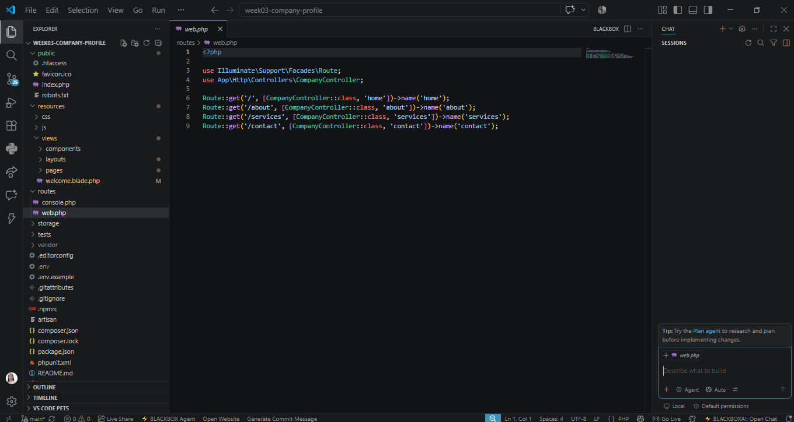

---

## 6. Controllers

### Purpose of Controllers
> The main purpose of a **controller** is to organize the logic that handles requests from the user. In this project, the **CompanyController** receives requests from the defined routes and returns the corresponding pages of the Company Profile Website. The controller acts as a connection between the **routes** and the **Blade views**.

### Benefits of Controllers
- Keeps the routes clean and organized
- Separates application logic from route definitions
- Makes the code easier to read and maintain
- Groups related page methods in one controller
- Supports the **MVC structure** of Laravel

### Controller Methods
> The **CompanyController** contains methods for the different pages of the website:

```php
public function home(): View
{
    return view('pages.home');
}

public function about(): View
{
    return view('pages.about');
}

public function services(): View
{
    return view('pages.services');
}

public function contact(): View
{
    return view('pages.contact');
}

### Controller Screenshot
![Controller]public/screenshots/controller.PNG 


---

## 7. Blade Templating Engine

### What is Blade?
> **Blade** is Laravel's powerful templating engine that allows you to write dynamic content in your views. It is simple to use and comes with useful directives that help structure your pages efficiently.

### Blade Layouts
> **Blade layouts** are used to create a common structure for multiple pages. In this project, the main layout contains the shared parts of the website such as the navigation bar, content area, and footer. This avoids repeating the same code on every page.

### Blade Components
> **Blade components** are reusable parts of the interface. This project uses components for the navbar and footer, making it easier to update them across all pages at once.

### Important Blade Directives

| Directive | Description |
|-----------|-------------|
| `@extends` | Allows a Blade page to inherit the structure of another Blade layout. |
| `@section` | Defines the content that will be inserted into a specific section of the layout. |
| `@yield` | Creates a placeholder inside the layout where content from individual pages will be displayed. |
| `@include` | Allows another Blade file to be inserted into the current view. |

### How They Work Together
1. The master layout (`layouts/app.blade.php`) defines the common structure using `@yield` placeholders.
2. Each page (e.g., `home.blade.php`) uses `@extends` to inherit the master layout.
3. Each page uses `@section` to fill in the content for the placeholders.
4. Reusable parts like the navbar and footer are included using `@include`.

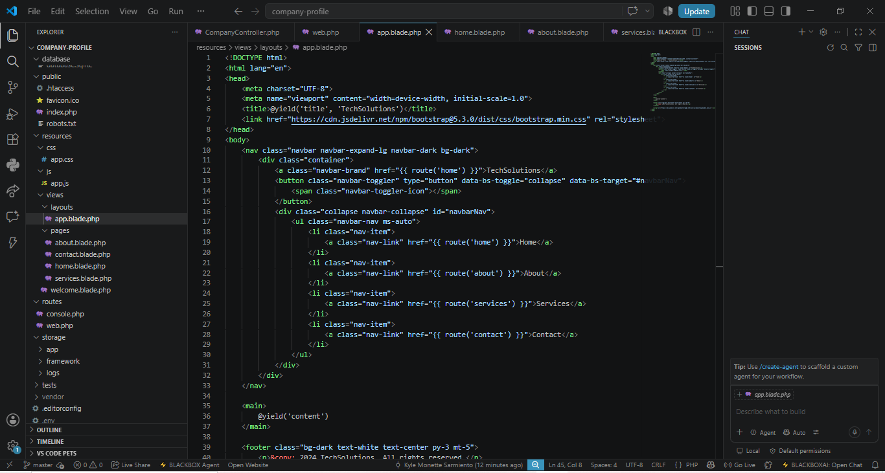

---

## 8. Laravel Folder Structure
- **`app/`** - Contains core application logic (**Models**, **Controllers**, etc.)
- **`routes/`** - Contains route definitions (`web.php`, `api.php`)
- **`resources/`** - Contains views, CSS, and JavaScript files
- **`public/`** - Publicly accessible files (images, CSS, JavaScript)
- **`bootstrap/`** - Application bootstrap and caching
- **`config/`** - Application configuration files

---

## 9. Screenshots
### Home Page
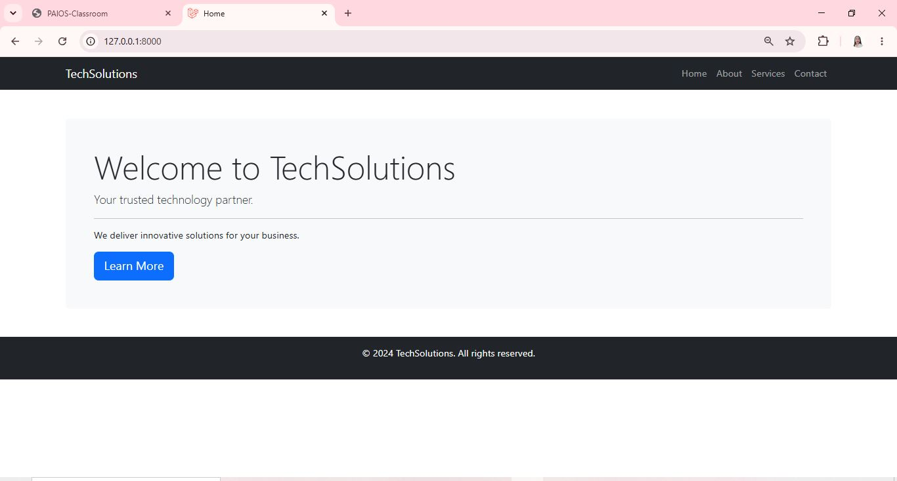
### About Page
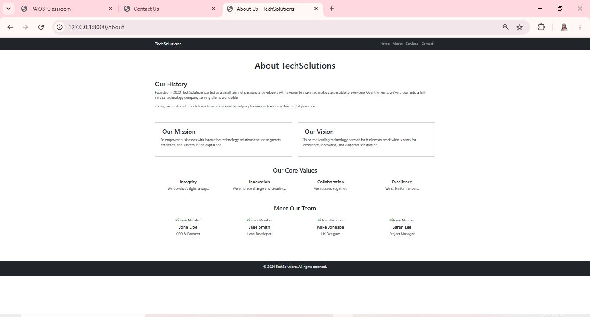
### Services Page
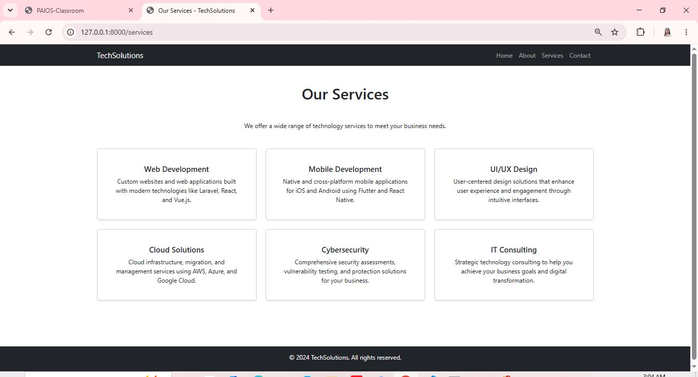
### Contact Page
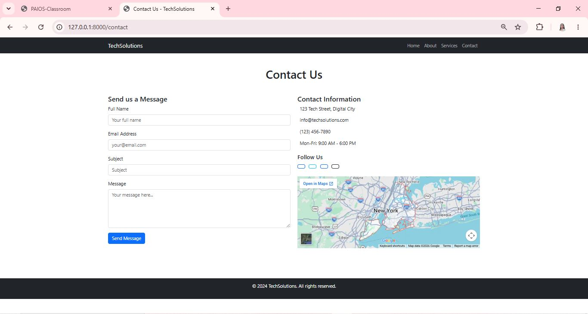
### Navigation Bar
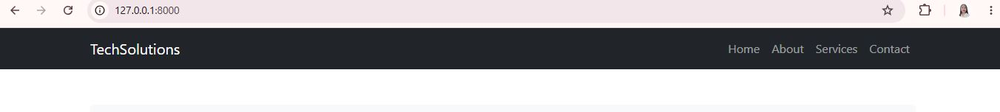
### Footer

### Routes

### Controller
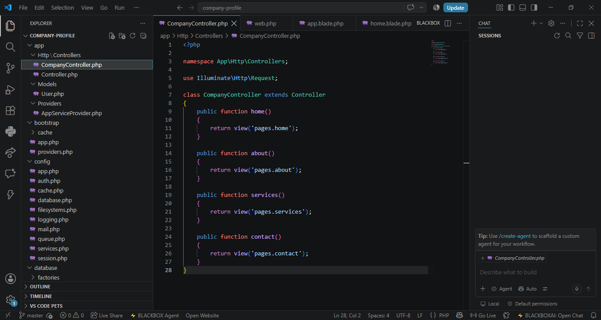
### Blade Layout

### VS Code Structure - Part 1
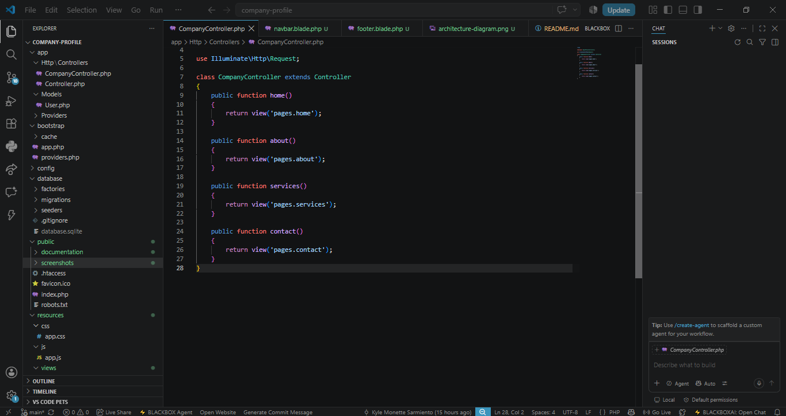
### VS Code Structure - Part 2
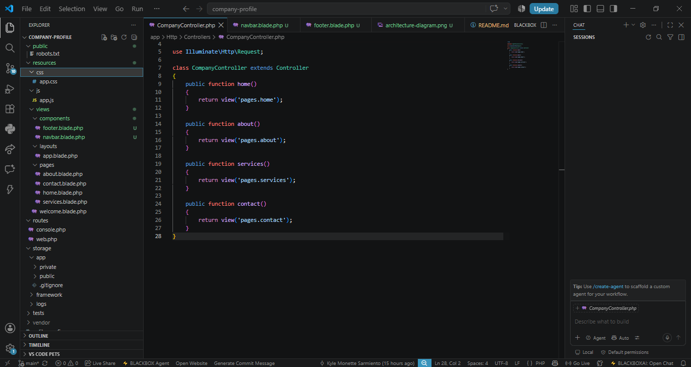
### VS Code Structure - Part 3
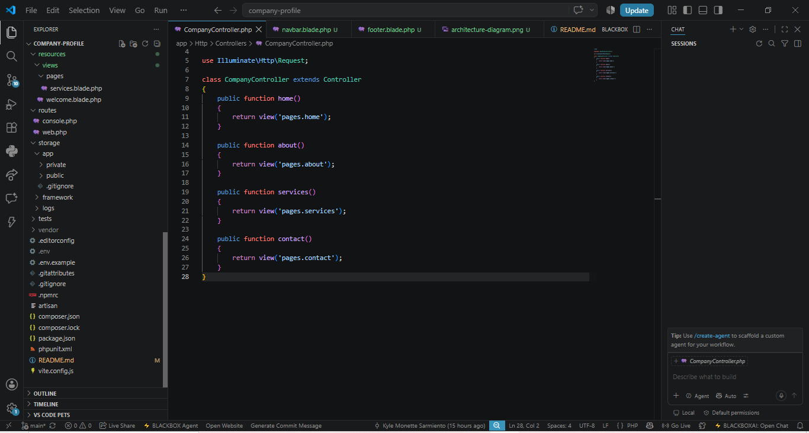
### Browser Output
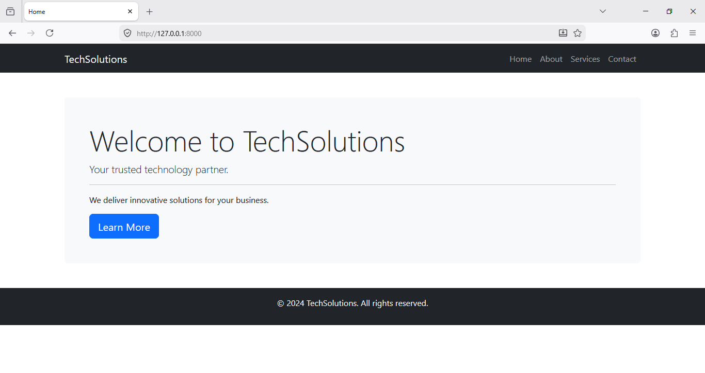
### GitHub Repository
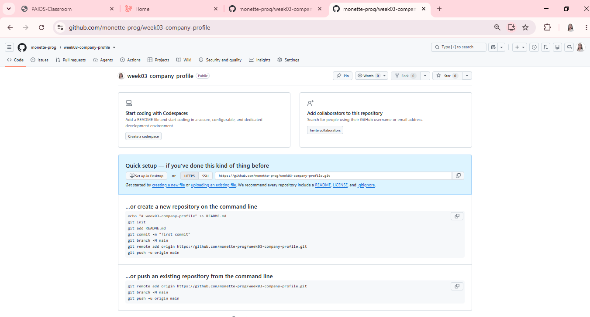

---

## 10. Problems Encountered
> 1. **View not found** – Missing **Blade templates** caused errors when views were not created properly.
> 2. **Controller namespace issues** – Incorrect **namespace** prevented Laravel from finding the classes.
> 3. **@include errors** – Using `@include` without the actual component file caused **runtime errors**.

---

## 11. Solutions
> 1. **View not found** – Created the missing **Blade view** files in the correct directory.
> 2. **Controller namespace issues** – Verified that the controller class had the proper **namespace** and was imported correctly.
> 3. **@include errors** – Removed the `@include` directives from the master layout and embedded the code directly.

---

## 12. Reflection

> Before starting this project, I only had a theoretical understanding of **MVC**. I knew that **Model** stood for data, **View** for the user interface, and **Controller** for the logic, but I didn't fully grasp how they interacted in a real-world application. This project gave me the hands-on experience I needed to truly understand the concept. I now see that the **Model** handles the data and business rules, the **View** presents the data to the user, and the **Controller** acts as the bridge, receiving user input and coordinating the response.

> Through this project, I learned the importance of **separation of concerns** in web development. The **MVC architecture** allows developers to organize code logically, making it easier to maintain and scale applications. I also gained a deeper understanding of how **Laravel** processes requests from the route definition, to the controller, to the view, and finally returning the response to the browser.

> This experience showed me how **routes**, **controllers**, and **views** work together. Routes define the URL structure, controllers handle the business logic, and Blade views present the data to users. This architecture can be applied to larger enterprise systems because it allows teams to work independently on different parts of the application while maintaining consistency and code reuse.

> One specific challenge I encountered was with **Blade templating**. At first, I found it confusing to use `@section` and `@yield` to create a master layout. I kept getting errors because my views were not extending the layout correctly. However, after carefully reviewing the Laravel documentation and experimenting with the code, I realized that the layout file defines the structure with `@yield`, and the child pages use `@section` to fill in the content. This "aha" moment made me appreciate how powerful and efficient **Blade** is for creating consistent, reusable interfaces.

> I also learned how to use **Blade templating** to create reusable layouts, which saved me from duplicating code across multiple pages. The ability to use `@yield` and `@section` made my code cleaner and more maintainable. Instead of writing the same navigation and footer code on every page, I was able to define them once in the master layout and simply extend it on each page. This not only saved time but also made the code easier to update. If I needed to change the navigation, I only had to edit one file instead of four.

> Another important lesson was learning to manage project files and folders properly. I initially placed some files in the wrong directories, which caused errors when I tried to run the application. Fixing these mistakes taught me the importance of following **Laravel's conventions**. For example, placing views inside the correct `resources/views/` subdirectories ensures that the application can find them without any extra configuration. This experience reinforced the idea that structure and organization are key to building maintainable software.

> One of the biggest takeaways from this project is the importance of **version control**. Using **Git and GitHub** allowed me to track my progress, experiment with changes, and roll back if something went wrong. This is a skill I will definitely use in future projects. I made sure to commit my changes regularly, which helped me track my progress and easily revert to previous versions if something went wrong. Writing meaningful commit messages also made it easier for me to review my work and understand what I had accomplished at each stage. This practice is something I will continue to apply in all my future projects.

> This project also helped me realize how the **client-server model** works in practice. When a user visits the website, their browser sends a request to the server, which passes through the route, hits the controller, and returns a Blade view. Seeing this flow in action gave me a clearer picture of how web applications operate behind the scenes. It also made me appreciate how **Laravel** handles the entire request lifecycle efficiently.

> In the future, I plan to apply these skills to larger enterprise systems. The **MVC architecture** is widely used in the industry, and understanding how to separate concerns, organize code, and use templating engines will be invaluable as I take on more complex projects. I am now more confident in my ability to build web applications using frameworks like Laravel and am excited to continue learning and improving.

> Overall, this project was a great introduction to **Laravel** and **MVC architecture**. I feel more confident in my ability to build web applications using frameworks and understand how the **client-server model** works in practice. I am grateful for this learning experience and look forward to applying these skills in future projects and in my career as a developer.

## 13. References
> - Laravel. (2026). *Laravel - The PHP Framework for Web Artisans*. https://laravel.com/docs/13.x/installation
> - PHP Documentation Group. (2026). *PHP Manual*. https://www.php.net/docs.php
> - MDN Web Docs. (2026). *Web development references*. https://developer.mozilla.org/en-US/
> - Tailwind CSS. (2026). *Tailwind CSS documentation (v2.0)*. https://v2.tailwindcss.com/docs
